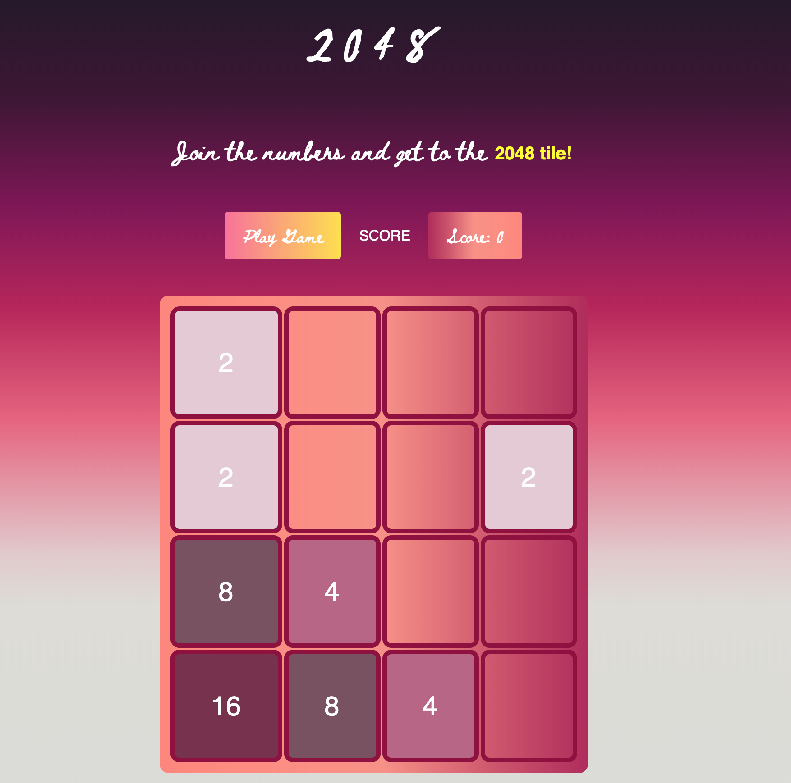

# 2048_Game
------

<h3>1. GOAL</H3>

The objective of the game is to reach 2048 by merging adjacent similar number tiles on a 4x4 board.

The game starts with two tiles of 2 random positions on the board, and continues to add new tiles of 2 or 4 on random tiles after every move. 

The game ends when the board is completely filled with numbers and  you don’t have any move left.

------

<h3>2. HOW TO PLAY </H3>

- Use your **arrow keys** to move the tiles. 
- When two tiles with the same number touch, they **merge into one**!

-----

<h3>3. Wireframe</h3>

![click here to play!] (https://nyantsar.github.io/2048_Game/)