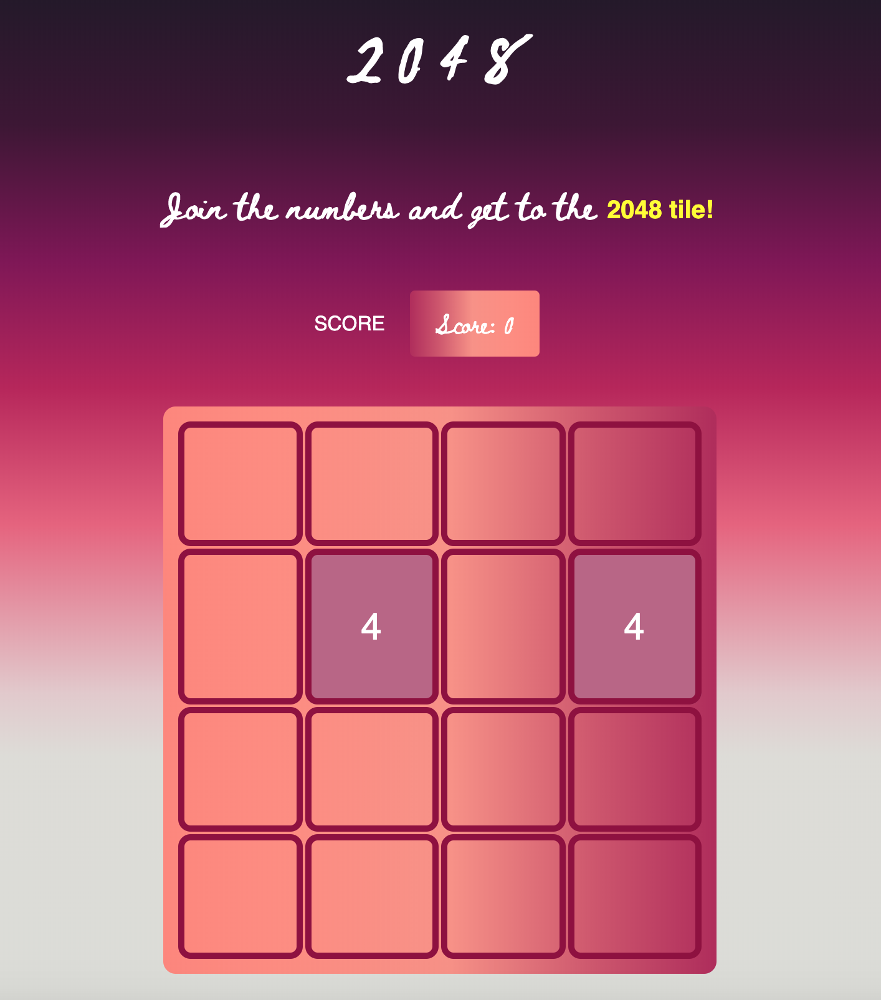

# 2048_Game
------

<h3>1. GOAL</H3>

2048 is a single-player sliding block puzzle game where the goal is to slide numberd tiles on a grid to combine them to create a tile with the number 2048.

------

<h3>2. HOW TO PLAY </H3>

Use your **arrow keys** to move the tiles. When two tiles with the same number touch, they **merge into one**!

-----

<h3>3. Wireframe</h3>

click here to play!